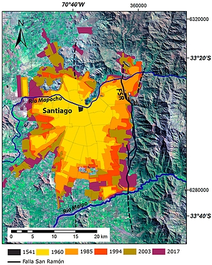
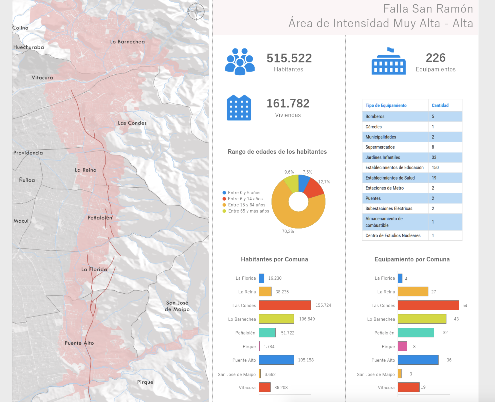
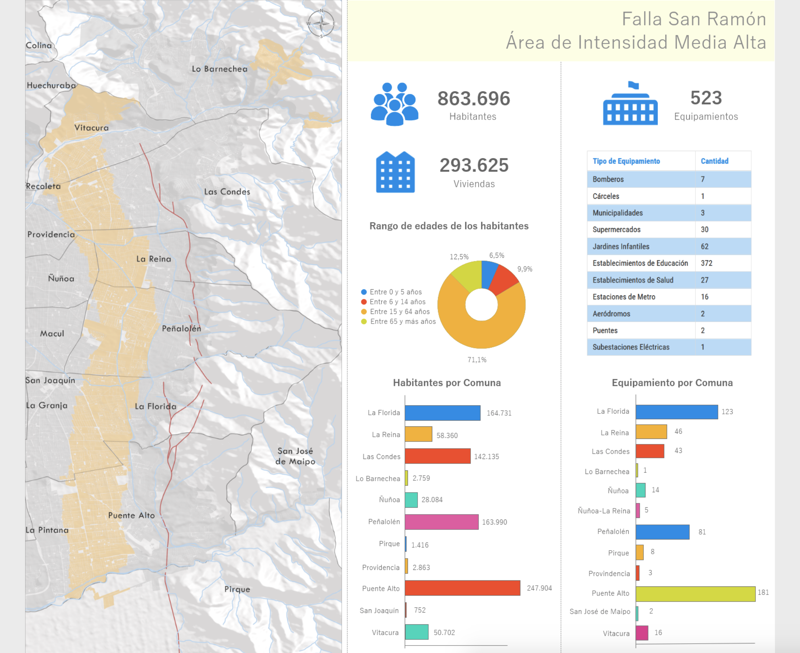
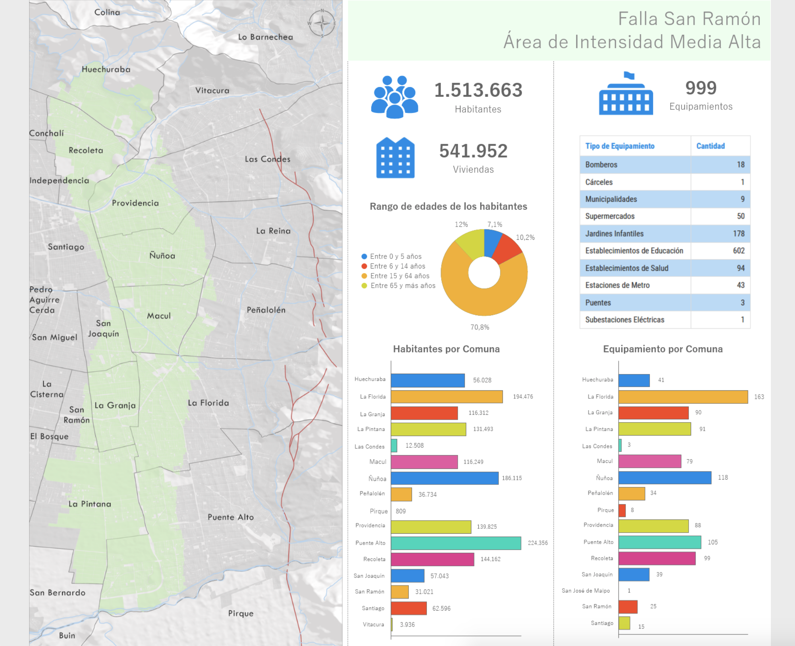

-Quién lo va a leer: Personas que viven en Santiago.
-Qué quieren los lectores: Informarse de la Falla de San Ramón para estar conscientes de posibles catástrofes. 
-Que queremos nosotras: Informarlos y hacer consciencia sobre los riesgos de la falla.

Puntos principales
→ ¿Qué es una falla? 
→ ¿Qué es la falla de San Ramón? (qué tipo, dónde está + mapa, longitud, profundidad, áreas de riesgo, zonas involucradas, principales características etc etc…)

→ Posible catástrofe: Magnitudes, ruptura, cambios geográficos, desniveles, cuando ocurre, predicciones, ciclos y monitoreo
→ Urbanización: Historia de cómo se ha construido alrededor de la falla scroll down: van pasando los años pa ver como aumentan las casas/edificios/idk

→ Mapa de su ubicación actual / áreas de peligro hover y clicks (Cuánta gente vive, que edificaciones hay, hectáreas, etc)
  
